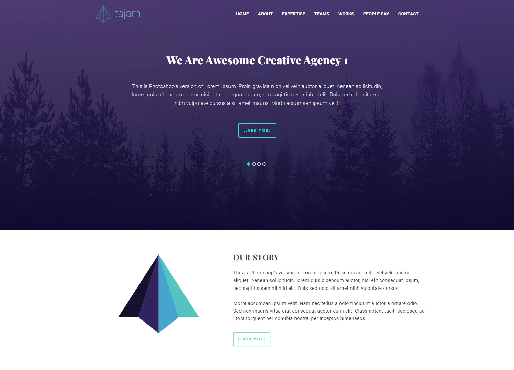

# Visitka
🌚 страничка-визитка по бесплатному psd

 

<!-- ccылка на проект -->

## Что это?

Cайт-визитка для моего портфолио. Сверстана по бесплатному psd.

**Год разработки**: 2021 год

### ✒️ История создания проекта
Создано для портфолио. Тогда я поняла, что мои сайты все под NDA или слишком серьезные, чтобы их вкладывать в портфолио. Так в нем было только 2 небольших проекта. Для наработки портфолио мне не хватало одного-двух проектов. Как вариант была верстка страницы по бесплатным шаблонам. Что и было сделано. Так как мне очень нравится добавлять анимации и эффекты на чистом css, я максимально добавила их на эту страницу. 

### 🔎 Почему был выложен этот проект?

1. Во первых, репрозиторий выложен в публичный доступ для показа своих возможностей будущим работодателям и всем интересующимся
2. Во вторых, репрозиторий создан для истории. По коду в проекте можно понять, какой стиль кода был у меня в 2021 году.

### 👀 Где можно увидеть проект?
Увидеть проект вживую можно на сайте: https://swenlii.up.railway.app/works/visitka

## Технологии

</img>

## Требования
- npm v7.20.6
- node >= 16.13.1
- Поддерживает все современные браузеры
- Проект запускался на windows с использованием программы visual studio

## Установка

1. `npm install`
2. `node app.js`
